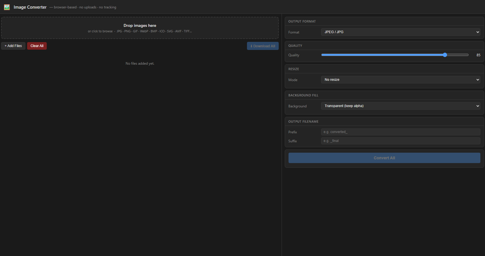

# Image Converter

> [!TIP]
> This tool is actively maintained as a personal developer utility. Feature requests and bug reports are welcome via GitHub Issues and will be reviewed within 1–3 weeks.

> [!WARNING]
> ⚠️ CAUTION: This repository contains code developed with the assistance of Artificial Intelligence (AI). While functional, AI-generated code can introduce hidden bugs, security vulnerabilities, or logic flaws that may not be immediately apparent. Please thoroughly review, audit, and test all files in an isolated development environment before deployment, as this software is provided as-is and used entirely at your own risk.

## 🚀 Introduction

Image Converter is a browser-based image format conversion tool built as a single self-contained HTML file — no server, no login, no activity logging, no backend. It runs entirely in the browser using the Canvas API with no external dependencies and sends no data anywhere.

The interface is built around a compact two-column layout with a drag-and-drop file area and file list on the left, and a conversion settings panel on the right. It supports batch conversion of multiple files at once, format-specific quality settings, resize modes, background fill control, and custom output filename rules. Converted files are downloaded directly in the browser — all without installing anything.

It is intended as a compact, focused alternative to desktop image tools and online converters — entirely within the browser, with no account, no tracking, no uploads, and no friction.

---

## 🔥 Features

A comprehensive feature set covering common image conversion workflows with a polished, production-ready interface.

### 🛡️ Privacy & Zero Dependencies

No account or API key required. All image processing runs locally in your browser using the Canvas API — no files are uploaded to any server and no data leaves your machine. The interface is fully offline-capable after the initial file load. No external library files are needed; everything is self-contained within `index.html`.

### 📥 Input Format Support

Any image format your browser can decode is accepted as input. Drop one or multiple files at once:

| Format | Notes |
|---|---|
| JPEG / JPG | All browsers |
| PNG | All browsers |
| GIF | All browsers |
| WebP | Chrome, Firefox, Edge, Safari 14+ |
| BMP | All browsers |
| SVG | All browsers |
| ICO | Most browsers |
| AVIF | Chrome, Firefox, Edge |
| TIFF / TIF | Safari, partial support elsewhere |
| HEIC / HEIF | Safari on macOS/iOS |

### 🖼️ Output Formats

Seven output formats are supported, each with dedicated settings:

| Format | Encoder | Notes |
|---|---|---|
| JPEG / JPG | Canvas API | Lossy, configurable quality, no transparency |
| PNG | Canvas API | Lossless, full transparency support |
| WebP | Canvas API | Lossy or lossless, configurable quality |
| AVIF | Canvas API | Modern lossy format, requires Chrome/Firefox/Edge |
| ICO | Built-in encoder | Multi-size ICO container with embedded PNGs |
| BMP | Built-in encoder | Uncompressed, 24-bit or 32-bit |
| GIF | Built-in encoder | Static GIF, palette quantization + LZW compression |

### ⚙️ Conversion Settings

Each output format exposes its relevant quality parameters:

| Format | Setting | Options |
|---|---|---|
| JPEG | Quality | 1 – 100 |
| WebP | Quality | 1 – 100 |
| WebP | Lossless | On / Off (ignores quality when enabled) |
| AVIF | Quality | 1 – 100 |
| ICO | Embedded sizes | 16×16, 32×32, 48×48, 64×64, 128×128, 256×256 (multi-select) |
| BMP | Bit depth | 24-bit RGB, 32-bit RGBA |
| GIF | Colors | 16, 64, 128, 256 |
| GIF | Dithering | Floyd-Steinberg on / off |

### 📐 Resize Options

Six resize modes are available for all output formats:

| Mode | Behavior |
|---|---|
| No resize | Output matches source dimensions |
| Fixed width | Scale to target width; optionally maintain aspect ratio |
| Fixed height | Scale to target height; optionally maintain aspect ratio |
| Fit within | Uniformly scale to fit inside a W×H bounding box (never upscales) |
| Exact W×H | Stretch to exact dimensions regardless of aspect ratio |
| Cover W×H | Scale and center-crop to fill exact dimensions |

### 🎨 Background Fill

For formats that do not support transparency (JPEG) or where transparency is undesirable (WebP, AVIF, GIF, BMP), a background fill can be applied before conversion:

| Option | Behavior |
|---|---|
| Transparent | Preserves alpha channel as-is |
| White | Fills transparent areas with white |
| Black | Fills transparent areas with black |
| Custom color | Fills with a user-picked color via color picker |

### 📂 Batch Processing

Multiple files can be added at once via drag-and-drop or the file picker. All files are converted sequentially using the same output settings. Each file shows an individual status indicator (pending, converting, done, error). Errors on individual files do not interrupt the rest of the batch.

### 💾 Download

Each converted file gets an individual download button. After a batch conversion, a **Download All** button triggers staggered downloads for all successfully converted files at once.

---

## 🗒️ Requirements

No server-side requirements. The interface runs entirely in the browser.

| Requirement | Value |
|---|---|
| Modern Browser (Chrome, Firefox, Edge, Safari) | Required |
| JavaScript enabled | Required |
| Internet connection | Not required |
| External library files | None — fully self-contained |
| Screen resolution | 900×600 minimum recommended |

---

## 🛠️ Usage

### 📄 Local File

Download `index.html` from this repository and open it directly in your browser. Everything is self-contained in that single file — no CDN, no network requests, no build step, no companion files required.

1. Open `index.html` in any modern browser.
2. Drop image files onto the drop zone or click **+ Add Files**.
3. Choose an output format and configure conversion options on the right panel.
4. Click **Convert All**.
5. Download individual files or use **⬇ Download All**.

### 🌐 GitHub Pages

The interface is also hosted via GitHub Pages directly from this repository. No installation required — open the link in any modern browser:

[https://bugfishtm.github.io/js-image-converter/](https://bugfishtm.github.io/js-image-converter/)

---

## 📁 Repository Structure

| Path | Description |
|---|---|
| .git/ | Internal file, can be ignored. |
| .github/ | Internal file, can be ignored. |
| index.html | The complete Image Converter — single self-contained HTML file. |
| [README.md](README.md) | This readme file. |
| [LICENSE.md](LICENSE.md) | License file. |

---

## 💬 Support Channels

If you encounter any issues or have questions while using this software, feel free to contact us:

- **GitHub Issues** is the main platform for reporting bugs, asking questions, or submitting feature requests: [https://github.com/bugfishtm/js-image-converter/issues](https://github.com/bugfishtm/js-image-converter/issues)
- **Discord Community** is available for live discussions, support, and connecting with other users: [Join us on Discord](https://discord.com/invite/xCj7AEMmye)
- **Email support** is recommended only for urgent security-related issues: [security@bugfish.eu](mailto:security@bugfish.eu)

---

## 📢 Spread the Word

Help us grow by sharing this project with others! You can:

* **Tweet about it** – Share your thoughts on [Twitter/X](https://twitter.com) and link us!
* **Post on LinkedIn** – Let your professional network know about this project on [LinkedIn](https://www.linkedin.com).
* **Share on Reddit** – Talk about it in relevant subreddits like [r/webdev](https://www.reddit.com/r/webdev/) or [r/opensource](https://www.reddit.com/r/opensource/).
* **Tell Your Community** – Spread the word in Discord servers, Slack groups, and forums.

---

## 🌱 Contributing to the Project

Thank you for your interest in this project.

At this time, this repository is **not open for external contributions**.
Please do **not** submit pull requests or patches.

- Pull requests from external contributors are not accepted.
- Any unsolicited pull requests will be closed without review.
- All code in this repository is maintained by the project owner.
- By design, no third‑party code will be merged into this project via GitHub.

If you encounter a bug or have an enhancement suggestion, please check the "Issues" section of our GitHub repository or visit our official website for guidance before beginning any work on it.

---

## 🤝 Community Guidelines

We're focused on developing innovative solutions and advancing technology. By being part of this, you contribute to our progress.

Positive guidelines include being kind, empathetic, and respectful in all interactions. It is important to engage thoughtfully and offer constructive, solution-oriented feedback. Fostering an environment of collaboration, support, and mutual respect is essential.

Unacceptable behaviors include harassment, hate speech, or offensive language. Personal attacks, discrimination, or any form of bullying are not tolerated. Sharing private or sensitive information without explicit consent is strictly prohibited.

Together, we can partner to achieve common goals by following guidelines designed to promote effective collaboration and positive teamwork.

---

## 🛡️ Security Policy

I take security seriously and appreciate responsible disclosure. If you discover a vulnerability, please follow these steps:

- **Do not** report it via public GitHub issues or discussions. Instead, please contact the [security@bugfish.eu](mailto:security@bugfish.eu) email address directly.
- Provide as much detail as possible, including a description of the issue, steps to reproduce it, and its potential impact.

I aim to acknowledge reports within **2–4 weeks** and will update you on our progress once the issue is verified and addressed.

This software is provided as-is, without any guarantees of security, reliability, or fitness for any particular purpose. We do not take responsibility for any damage, data loss, security breaches, or other issues that may arise from using this software. By using this software, you agree that We are not liable for any direct, indirect, incidental, or consequential damages. Use it at your own risk.

---

## 📜 License Information

The license for this software can be found in the [LICENSE.md](LICENSE.md) file. The software may also include additional licensed software or libraries.

🐟 Bugfish
